# 2025年排名前18的加密货币衍生品交易平台汇总(最新整理)

加密货币衍生品交易已成为数字资产投资者获取杠杆收益的核心工具。无论您是希望通过期货合约对冲现货风险,还是利用期权策略在波动市场中捕捉机会,选择一个流动性深、执行速度快、风控机制完善的交易平台至关重要。本文精选全球18家领先的加密货币衍生品平台,涵盖永续合约、交割期货、期权交易等多种产品类型,帮助您快速找到最适合自己交易风格和资金规模的解决方案。

## **[Delta Exchange](https://delta.exchange)**

专为印度市场设计的合规加密货币期货期权交易平台,支持INR结算。

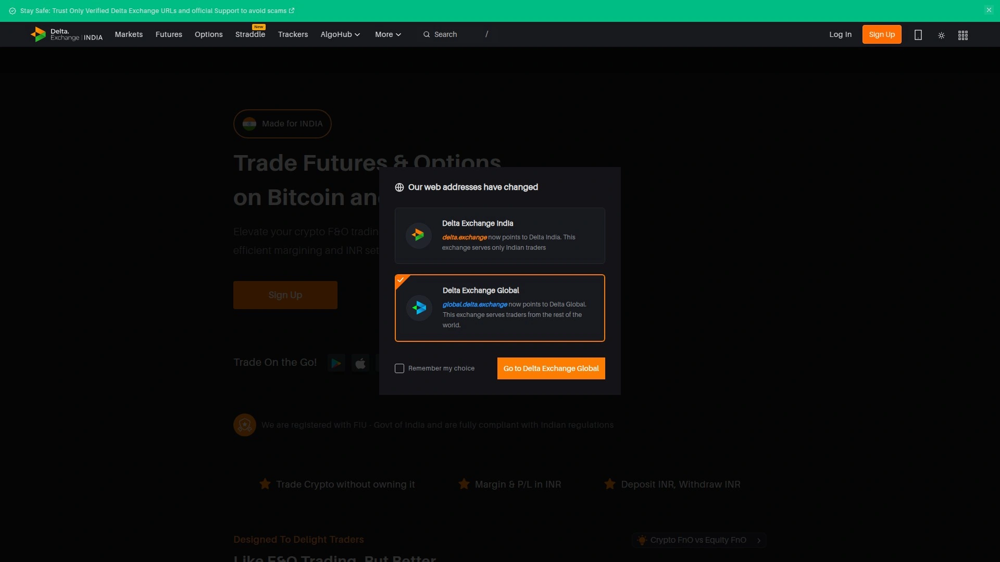

Delta Exchange是一家注册于印度金融情报部门(FIU)的合规交易平台,专注于比特币和以太坊的期货与期权交易。平台最大的特色在于无需持有加密货币即可开始交易,用户可以直接使用印度卢比(INR)充值、交易和提现。这种设计大幅降低了印度用户的入场门槛,避免了传统平台需要先购买加密货币再转入交易账户的繁琐流程。

**核心优势:** 平台提供高效保证金机制和24/7全天候开放市场,KYC验证过程仅需1分钟,用户只需准备Aadhar卡和PAN卡即可快速完成身份认证。所有盈亏以印度卢比计价,适合不想直接持有加密资产但希望参与数字货币市场波动的印度投资者。Delta Exchange提供60多个衍生品交易对,交易手续费从0.02%起。平台界面简洁易用,特别适合首次接触加密货币衍生品的新手用户,同时也为专业交易者提供了充足的交易工具和图表分析功能。

## **[Binance Futures](https://www.binance.com/en/futures)**

全球交易量最大的加密货币期货平台,流动性和产品多样性行业领先。

Binance Futures是币安交易所的衍生品交易部门,长期占据全球期货市场最高交易量,通常是第二名的两倍以上。平台提供超过340个衍生品交易对,涵盖比特币、以太坊等主流币种以及众多山寨币的永续合约和交割期货。用户可以选择稳定币结算(USDT/BUSD)或币本位结算的合约类型,最高支持高达125倍杠杆。Binance Futures的手续费结构极具竞争力,从0.05%起步,持有平台币BNB还可享受额外折扣。平台的订单匹配引擎性能卓越,即使在市场剧烈波动时也能保持稳定执行,滑点控制优秀。此外,Binance Futures还提供网格交易、跟单交易等自动化工具,以及完善的风险管理功能如止盈止损、自动减仓机制等。

## **[Bybit](https://www.bybit.com)**

以用户体验和交易性能著称的衍生品交易平台,提供超过400个合约交易对。

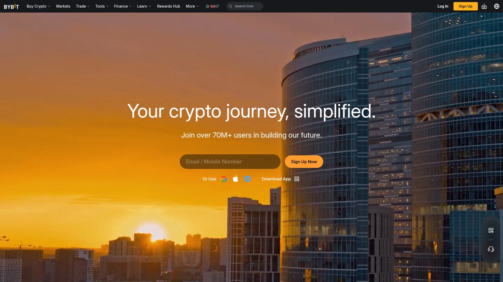

Bybit成立于2018年,最初就是一家专注期货交易的平台,后来才扩展到现货市场。平台提供400多个衍生品交易对,支持USDC和USDT稳定币结算,以及币本位合约。Bybit的交易界面设计流畅直观,系统延迟极低,特别适合高频交易者和专业投资者。平台在主流合约上提供高达100倍杠杆,手续费从0.055%起。Bybit持续推出创新产品,包括结构化衍生品、双币理财等,满足不同风险偏好用户的需求。平台的保险基金规模庞大,用户资产安全性有较好保障。移动端应用体验出色,支持全功能交易操作,方便随时随地管理持仓。

## **[OKX](https://www.okx.com)**

综合性加密货币交易平台,衍生品日交易量达数十亿美元。

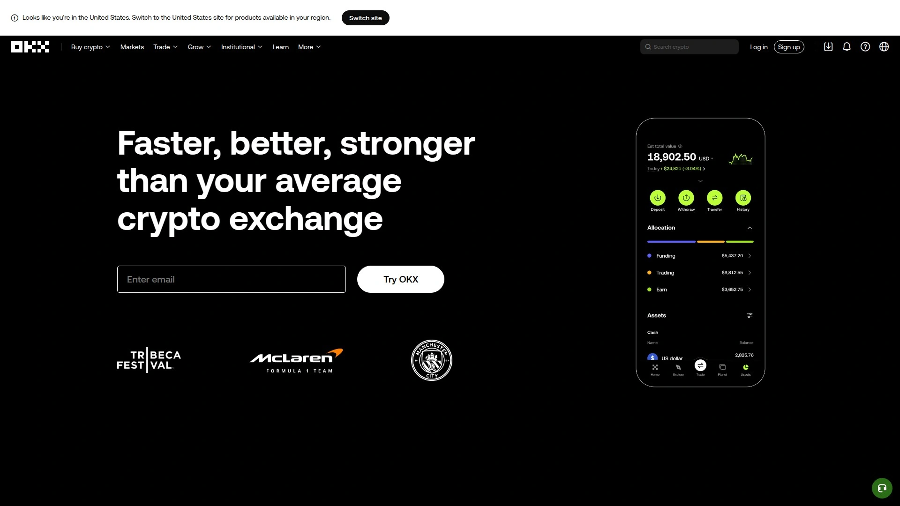

OKX提供永续掉期、期货和期权等全方位加密合约产品,拥有超过640个衍生品交易对,是市场上产品线最丰富的平台之一。平台的费率结构极具竞争力,现货和合约交易费用从0.05%起,持有平台币OKB或达到较高交易量可进一步降低手续费。OKX的一大特色是交易机器人市场,用户可以"跟随"其他交易者创建的策略机器人,也可以自己编写交易算法。平台已推出多个衍生品交易机器人,帮助用户实现自动化交易。OKX在全球多个市场积极扩张,移动端应用功能强大,支持的加密资产种类广泛,既适合山寨币爱好者也满足主流币交易需求。

## **[MEXC](https://www.mexc.com)**

提供600多个期货交易对,以最低费率和超高杠杆闻名。

MEXC Futures是市场上合约品种最多的平台之一,提供超过400个期货交易对,杠杆倍数高达500倍。平台的最大卖点是费率极低,Maker费用为负值,Taker费用也远低于行业平均水平。MEXC的新币上线速度快,覆盖加密货币品种广,适合追求高收益高风险的激进型交易者。平台流动性管理出色,超过90%的交易对都具备顶级流动性,即使在极端市场条件下也能保持稳定,避免意外爆仓。MEXC提供24/7客户支持,能够迅速解决用户问题。平台同时支持永续合约和交割合约,用户可以根据自己的交易策略灵活选择。移动应用功能完善,支持iOS和Android系统。

## **[Bitget](https://www.bitget.com)**

跟单交易功能领先的衍生品平台,全球前五大期货交易所。

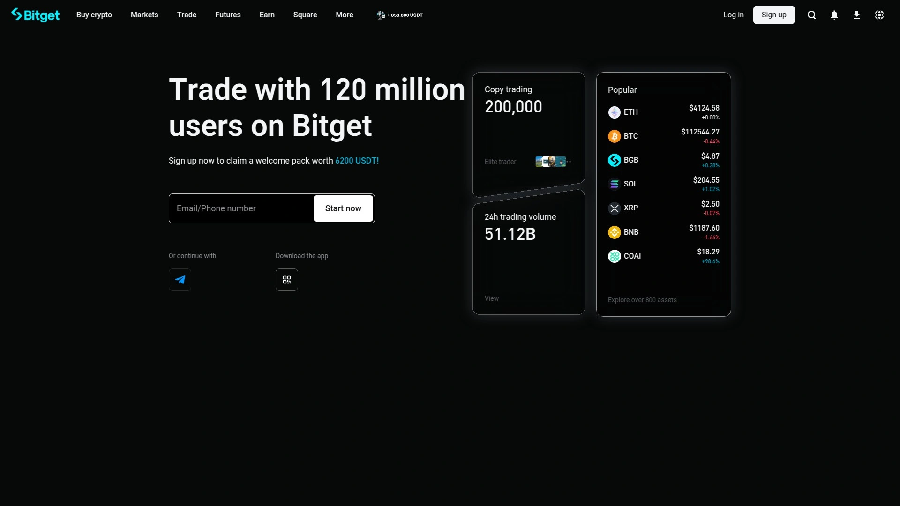

Bitget成立于2018年,目前在全球衍生品交易量排名前五。平台提供期货合约,最高支持125倍杠杆,覆盖多种加密货币。Bitget的核心产品是其跟单交易系统,允许用户自动复制精选交易者的持仓,这一功能吸引了大量用户。技术特性包括Quanto Swap合约(跨资产保证金交易)、模拟交易环境用于策略测试,以及网格交易自动化功能,同时支持现货和期货市场。安全基础设施包括冷存储系统和保险基金,费用结构采用Maker-Taker模式,期货交易费率从0.02%/0.06%起。平台提供230多个衍生品交易对。虽然平台提供适合经验丰富交易者的高级工具,但其界面复杂度可能对新手构成一定学习曲线。

## **[Bitfinex Derivatives](https://www.bitfinex.com/derivatives/)**

老牌交易所的衍生品部门,支持高达100倍杠杆。

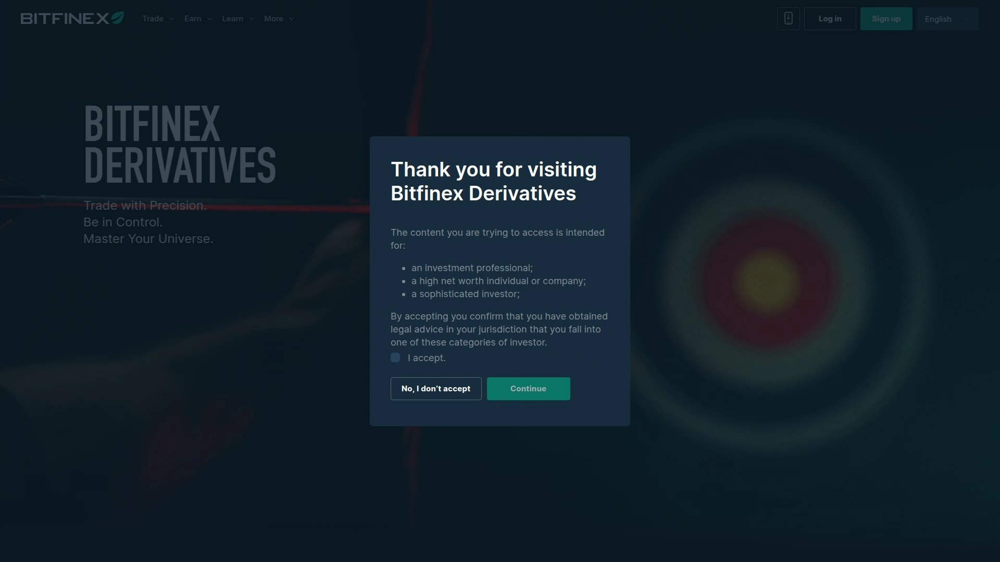

Bitfinex提供比特币和Tether USDT代币的衍生品交易,仅对中级及以上认证用户开放。平台支持永续合约和期货,提供90多个衍生品交易对,手续费从0.02%起。用户需要在衍生品钱包中持有BTC或USDT才能开始交易。Bitfinex衍生品交易的最大杠杆可达100倍,具体取决于交易对。平台提供完整的订单类型,包括限价单、市价单、止损单等,交易界面功能丰富,显示实时持仓、杠杆设置和盈亏情况。Bitfinex还与Thalex集成,用户可以通过Bitfinex账户无缝访问Thalex的USDT结算期权和期货产品。Thalex提供欧式线性期权,支持日、周、月、季度到期,以及对应的期货合约方便对冲。

## **[Kraken Futures](https://www.kraken.com)**

安全性和合规性顶级的期货平台,拥有多国监管牌照。

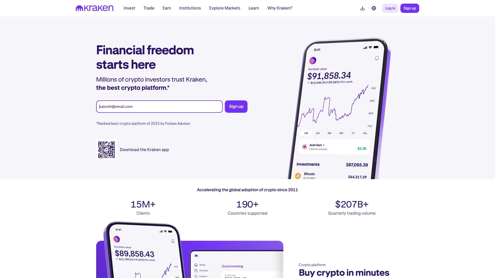

Kraken成立于2011年,是加密货币行业最受信任的交易所之一,运营十多年来保持着无安全事故的记录。虽然Kraken以现货市场闻名,但其在Kraken Pro下提供的期货交易平台同样出色。平台提供200多个期货交易对,涵盖比特币、以太坊及多种山寨币。Kraken Futures的杠杆上限为50倍,虽然低于某些竞争对手,但平台以强大的安全性、直观的界面和顶级客户支持作为补偿。平台提供超过250种加密货币和数百个交易对。Kraken特别注重监管合规,持有美国、加拿大、西班牙、英国等多国的监管牌照。需要注意的是,Kraken期货服务在部分地区不可用,包括美国、英国、澳大利亚、加拿大等国家。平台的费率极具竞争力,大额交易用户享受行业最低费率之一。

## **[BitMEX](https://www.bitmex.com)**

比特币永续期货合约的先驱者,专业交易者的首选。

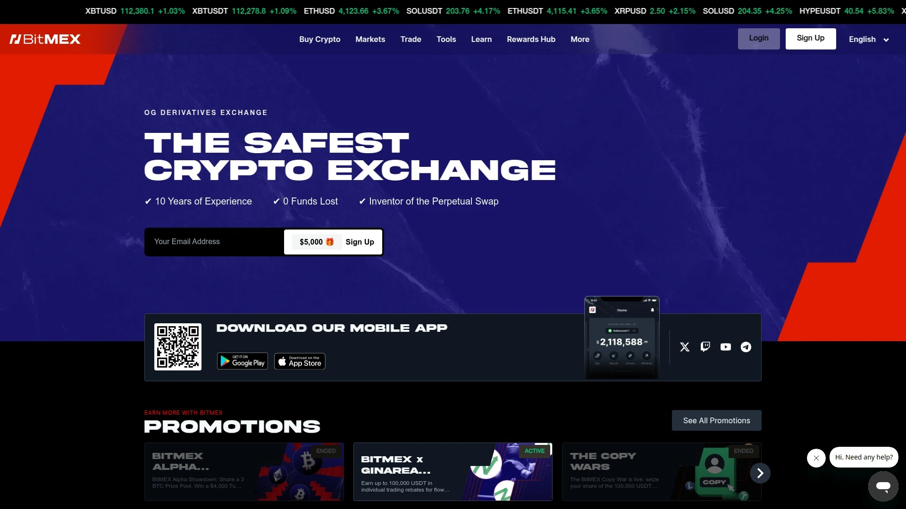

BitMEX是加密货币衍生品领域的开创者,率先推出比特币永续期货合约。虽然其在比特币永续期货市场的份额近年面临挑战,但平台仍然深受经验丰富的交易者青睐。BitMEX已扩展其产品线包括现货交易,但其核心优势仍在于加密货币衍生品平台,涵盖永续掉期和期货合约。这些合约可以使用BTC、USDT或ETH作为保证金。平台提供150多个衍生品交易对,交易费从0.02%起。BitMEX在比特币和以太坊衍生品上支持高达100倍杠杆,为寻求高收益机会的交易者提供潜力。平台推出了BMEX代币,类似于BNB和OKB等其他交易所代币,持有者享受交易费折扣,大额持有者甚至可能获得费用返还。BitMEX还提供免费的教育文章和交易指南,帮助初学者入门。

## **[Deribit](https://www.deribit.com)**

全球最大的加密货币期权交易所,机构级专业工具。

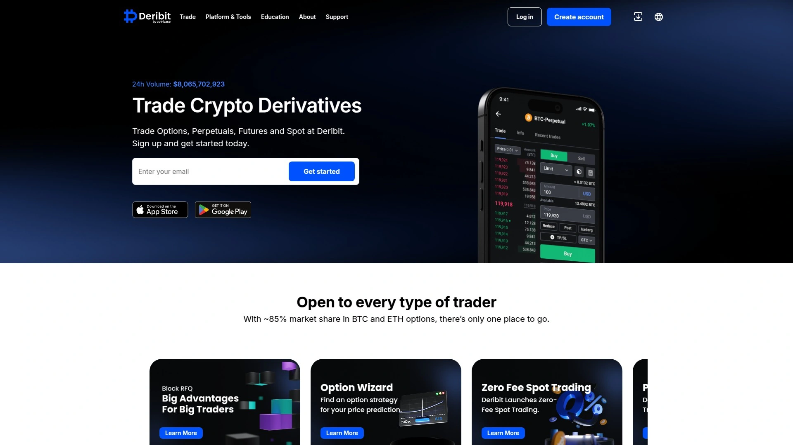

Deribit是期权交易领域的明确领导者,专注于加密货币期权市场,为对冲策略提供深度流动性和高级工具。专业交易者经常依赖Deribit来微调复杂持仓。平台提供90多个衍生品交易对,包括期权和期货,交易费从0.05%起。Deribit在比特币和以太坊期权与期货上提供最高50倍杠杆。平台是目前期权交易的首选交易所,除了加密货币期权外,还提供黄金(PAXG-USDC)的期权交易。Deribit的交易界面专为专业交易者设计,提供复杂的期权定价模型、希腊字母显示(Delta、Gamma、Vega等)和高级图表工具。平台的结算机制透明,风险管理系统完善,适合进行期权套利、波动率交易等高级策略。

## **[WhiteBIT](https://www.whitebit.com)**

提供150多个永续合约对,手续费极具竞争力。

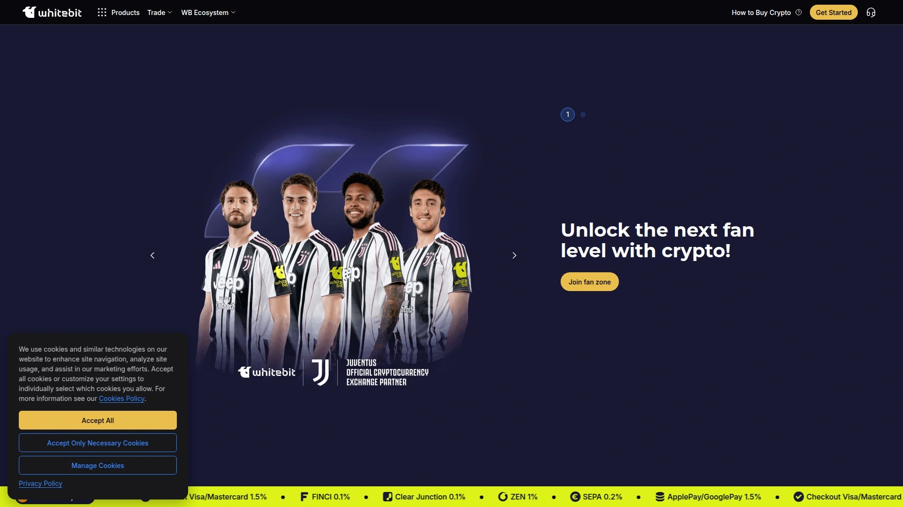

WhiteBIT为交易者提供全面的交易工具套件,包括永续期货合约,允许用户在上涨和下跌市场中均可获利。与其他领先交易所类似,WhiteBIT已确立自己作为期货交易可靠平台的地位。平台提供超过150个永续合约交易对,为交易者提供充足机会参与主流加密货币和小众山寨币交易。WhiteBIT支持比特币、以太坊等热门加密货币的期货交易,以及许多其他资产,满足多样化交易策略。平台的用户友好界面和高级交易工具使其成为新手和经验丰富期货交易者寻求强大交易环境的吸引选择。WhiteBIT的手续费从0.035%起,在行业中处于较低水平。平台还提供网格交易、止盈止损等风险管理工具,帮助用户更好地控制交易风险。

## **[KuCoin Futures](https://www.kucoin.com/futures)**

每四个加密货币持有者中就有一个使用KuCoin,提供520个可交易期货合约。

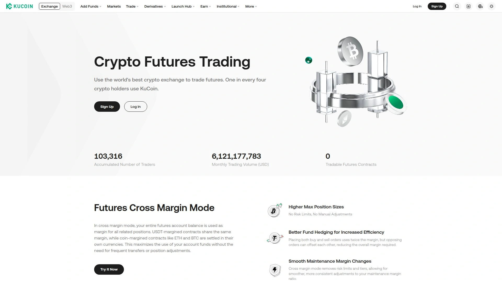

KuCoin Futures提供520个可交易期货合约,月度交易量超过1803亿美元。平台支持全仓保证金模式,用户的整个期货账户余额用作所有相关持仓的保证金。USDT保证金合约共享相同保证金,而ETH和BTC等币本位合约以各自货币结算。这最大化了账户资金使用效率,无需频繁转账或调整持仓。KuCoin Futures的优势包括:更高的最大持仓规模无风险限制无需手动调整;更好的资金对冲提高效率,同时买入和卖出订单使用双倍保证金,但相反订单可以相互抵消,减少所需总保证金;平稳的维持保证金变化,全仓保证金模式取消风险限制和等级,允许更平滑、一致的维持保证金率调整。平台通过领先技术确保每笔交易安全、可靠和透明,保险基金保护所有用户交易安全。

## **[Phemex](https://phemex.com)**

从衍生品专业平台演变为综合性交易所,支持高达100倍杠杆。

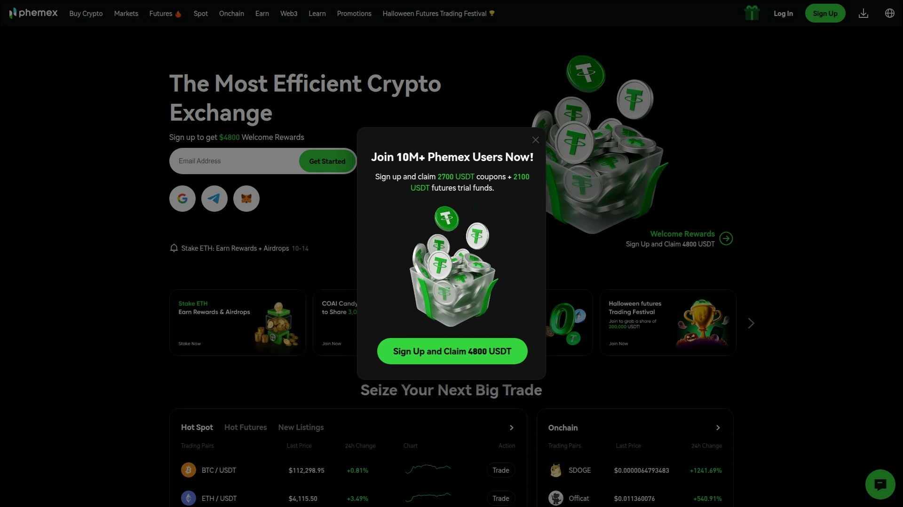

Phemex由前摩根士丹利高管于2019年在新加坡创立,最初是一家纯衍生品交易所,后来演变为混合加密平台,提供现货交易、跟单交易、DeFi工具等。衍生品交易仍是Phemex的核心优势,提供USD保证金和币保证金永续期货,最高支持100倍杠杆。平台的订单匹配引擎以低延迟和深度流动性著称,支持紧密价差和高效执行。Phemex提供518个永续合约交易对和522个现货币种。平台的独特功能包括一键设置止盈止损订单,强大的子账户管理系统,支持高级订单类型如ReduceOnly和PostOnly。Phemex还提供跟单交易功能,新手可以镜像专业交易者的策略。平台的Earn门户提供多种被动收入工具,包括固定和灵活储蓄、Launchpool质押奖励等。

## **[Gate.io Futures](https://www.gate.com/futures)**

提供590多个不同的加密合约,支持永续和交割期货。

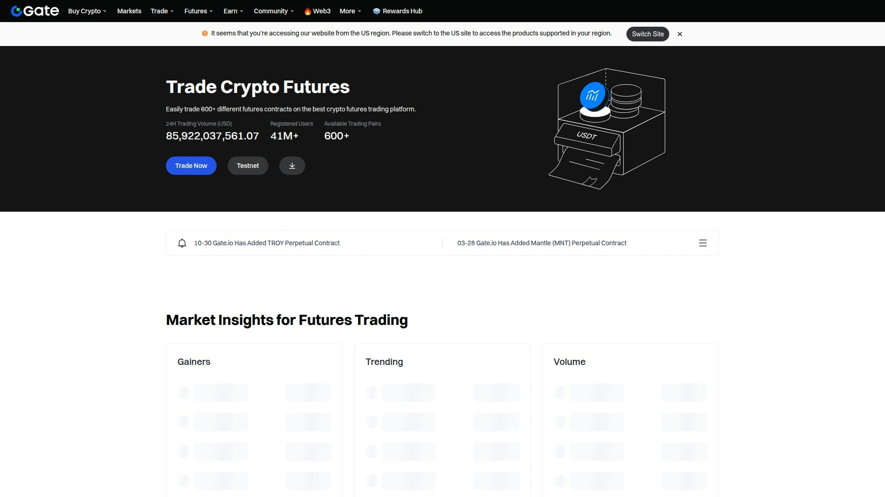

Gate.io提供超过590个不同的加密合约,用户可以立即开始交易比特币期货。平台支持两种主要的期货类型:永续期货和交割期货。大多数人交易永续期货,意味着持仓没有到期日,用户可以开立持仓并长期持有,想要平仓时只需关闭即可。交割期货则在特定时间点到期,分为每周或每季度到期。Gate.io的期货交易界面提供详细的市场数据、实时K线图和深度图表,帮助用户做出明智的交易决策。平台支持杠杆交易,用户可以根据风险承受能力选择合适的杠杆倍数。Gate.io还提供网格交易机器人、套利工具等自动化交易功能。移动应用功能完善,支持随时随地交易加密货币期货。平台的客户支持团队提供24/7服务,确保用户问题得到及时解决。

## **[HTX Futures (Huobi)](https://www.htx.com/futures)**

全球领先的加密货币交易平台,自2013年以来零安全事故记录。

HTX(原Huobi)是全球领先的加密货币交易所之一,自2013年成立以来拥有无与伦比的零安全事故记录,在全球拥有超过2000万用户。HTX Futures是华威集团旗下的数字资产衍生品交易平台,于2018年推出,旨在提供最安全、专业的衍生品交易服务。平台提供超过1000种加密货币,包括比特币(BTC)、以太坊(ETH)、索拉纳(SOL)、卡尔达诺(ADA)、波卡(DOT)、链链(LINK)、泰达币(USDT)、狗狗币(DOGE)、柴犬币(SHIB)和HTX代币(HT)等主要代币。HTX Futures支持对冲和套利,提供币本位和USDT保证金合约。平台的价格预警功能可在达到指定条件或价格时立即通知用户,帮助用户及时掌握市场动态。HTX支持通过VISA信用卡以多种法定货币(包括美元、欧元、英镑、瑞士法郎、澳元、印度卢比、泰铢等)购买加密货币。

## **[CME Group](https://www.cmegroup.com/markets/cryptocurrencies)**

全球领先的受监管衍生品交易市场,提供比特币、以太坊、索拉纳和XRP期权期货。

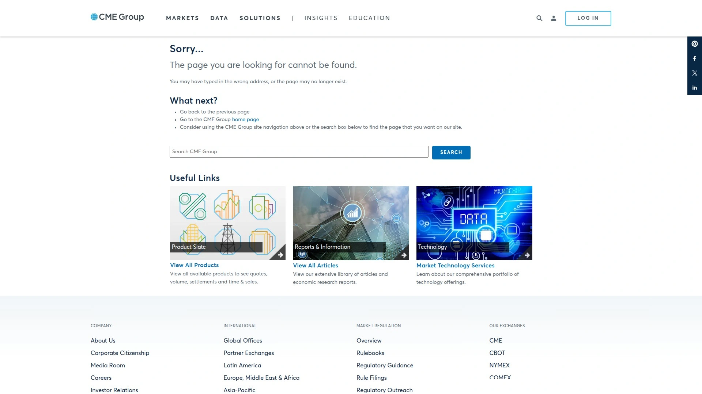

CME Group是世界领先的衍生品市场,为机构投资者提供受监管和安全的加密货币期货和期权交易。CME最近推出了索拉纳(SOL)和XRP期货的期权合约,进一步扩展其加密货币衍生品产品线。平台提供比特币、以太坊、索拉纳和XRP的期权期货,帮助投资者管理加密货币风险。CME的加密货币衍生品具有高流动性和多功能性,适合需要合规交易环境的机构投资者。与大多数离岸加密货币交易所不同,CME受到严格的金融监管,所有交易都在透明、受监管的环境中进行。CME的期货合约采用现金结算,无需实际持有或交付加密货币,简化了机构投资者的操作流程。平台的风险管理工具完善,包括清算机制、保证金要求等,确保市场稳定运行。

## **[Thalex](https://www.thalex.com)**

快速崛起的衍生品交易所,提供稳定币结算期权、期货和永续合约。

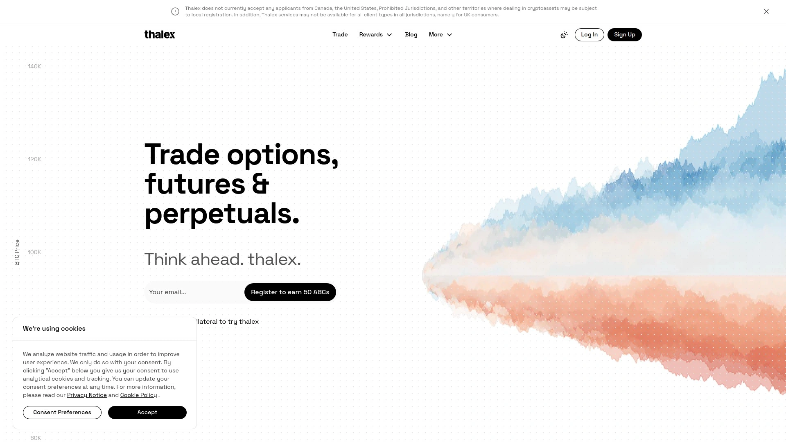

Thalex于2023年推出,迅速成为市场上的重要参与者,提供针对机构和高级散户交易者的创新功能。平台专注于稳定币结算的期权、期货和永续合约,使用户能够以降低的波动性风险和简化的定价模型进行交易。Thalex与Bitfinex和Bitstamp等主要交易所的集成扩大了其覆盖范围,允许无缝入驻和跨平台交易。凭借低费用(Maker和Taker费率均为1个基点)和基于投资组合的保证金提高资本效率,平台自上线以来已处理超过20亿美元的交易量,大部分来自机构客户。Thalex的突出特点之一是通过询价(RFQ)机制和专门的订单簿支持多腿策略。平台采用高效的清算流程,具有自动化Delta对冲和清算拍卖,以最大限度减少市场干扰。其市场质量计划通过每月20万美元的奖励池激励流动性提供,鼓励限价订单。

## **[Coinbase Derivatives](https://www.coinbase.com/derivatives)**

新型衍生品交易所,专注于为机构和散户交易者创建可访问的市场。

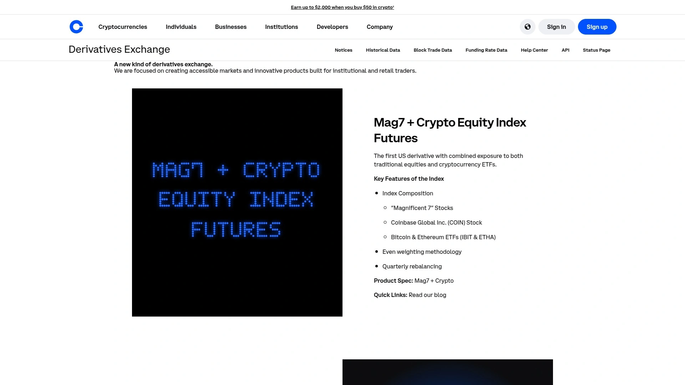

Coinbase Derivatives是Coinbase推出的衍生品交易平台,专注于创建可访问的市场和为机构及散户交易者构建的创新产品。作为美国最大的加密货币交易所Coinbase的衍生品部门,该平台受益于Coinbase强大的监管合规背景和品牌信誉。Coinbase Derivatives旨在为交易者提供安全、透明的衍生品交易环境,满足日益增长的机构和零售市场对受监管加密货币衍生品的需求。平台正在积极整合更多的衍生品产品,包括期货和期权,以满足不同交易者的需求。Coinbase的衍生品平台特别适合重视合规性和安全性的美国投资者。随着加密货币市场的成熟,Coinbase Derivatives有望成为北美地区重要的衍生品交易选择。

## **[BingX](https://www.bingx.com)**

社交化交易特色的衍生品平台,提供跟单交易和网格策略。

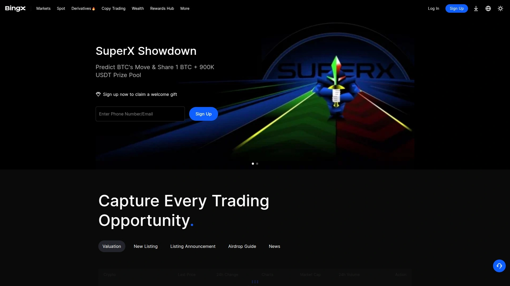

BingX是一家新兴的加密货币衍生品交易平台,以社交交易和跟单功能著称。平台提供现货和期货交易服务,支持数百种加密货币合约,用户可以使用高达125倍的杠杆进行交易。BingX的核心优势在于其完善的跟单交易系统,用户可以一键复制专业交易者的交易策略,实时同步持仓和操作。平台还提供多种自动化交易工具,包括网格交易机器人、马丁格尔策略等,帮助用户在不同市场环境下获取稳定收益。BingX的交易界面简洁直观,特别适合新手用户快速上手。平台的手续费较低,Maker费率为0.02%,Taker费率为0.05%。BingX还定期举办交易大赛和空投活动,为用户提供额外的收益机会。移动端应用功能完善,支持iOS和Android系统,用户可以随时随地管理持仓和执行交易。

***

## 常见问题

**如何选择适合自己的加密货币衍生品平台?**

首先考虑您的居住地区和监管要求,例如印度用户适合选择Delta Exchange这类支持本地法币结算的合规平台,而美国用户可能更适合CME或Coinbase Derivatives等受美国监管的交易所。其次评估您的交易经验水平:新手建议从界面友好、教育资源丰富的平台开始如Phemex或Bybit;专业交易者则可选择Deribit、BitMEX等提供高级工具的平台。最后关注平台的流动性、费率结构和杠杆选项是否符合您的交易策略。

**永续合约和交割期货有什么区别?**

永续合约没有到期日,交易者可以无限期持有头寸,只需支付资金费率以维持多空平衡,这是大多数平台最受欢迎的产品类型。交割期货则有明确的到期日(通常为每周或每季度),到期时系统会自动平仓并结算,价格通常会在到期前收敛于现货价格。永续合约更适合中短期交易和频繁调整仓位的策略,而交割期货适合有明确时间预期的套期保值或套利交易。两者在保证金要求、资金费用和价格机制上存在差异。

**加密货币衍生品交易的主要风险是什么?**

杠杆交易会放大收益的同时也会放大亏损,高杠杆可能导致快速爆仓。市场波动性极大,特别是在重大新闻或黑天鹅事件发生时,价格可能在短时间内剧烈波动。资金费率风险也不容忽视,持有永续合约需要定期支付或收取资金费率,长期单边持仓可能累积较高成本。此外,还需警惕平台安全风险、流动性风险(尤其是小币种合约)以及系统性风险如交易所宕机、清算机制失效等。建议始终使用止损订单、控制仓位大小、分散投资并充分理解每种衍生品的运作机制。

***

## 结语

本文汇总的18家加密货币衍生品交易平台各具特色,从全球交易量领先的Binance Futures到专注期权市场的Deribit,从合规性突出的CME Group到创新功能丰富的Bybit,满足不同地区、不同经验水平和不同交易策略的投资者需求。对于印度市场用户而言,[Delta Exchange](https://delta.exchange)以其INR直接结算、无需持有加密货币即可交易、快速KYC认证等独特优势,成为最适合本地投资者的首选平台。无论您是希望通过期货合约进行风险对冲,还是利用期权策略捕捉市场波动机会,选择流动性充足、安全可靠、费率合理的交易平台都是成功的第一步。
